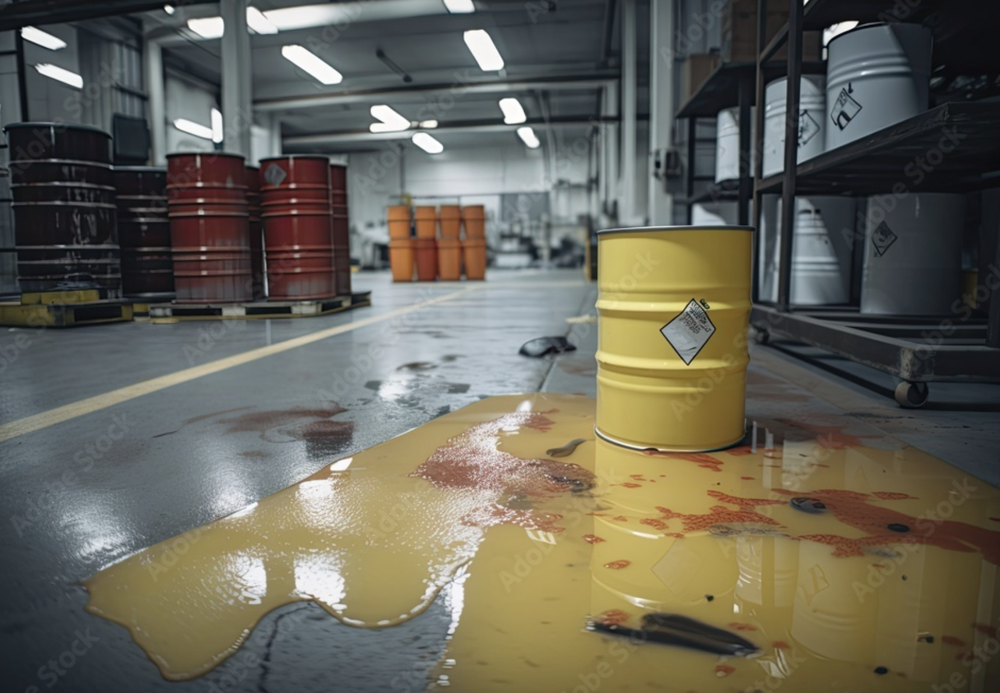
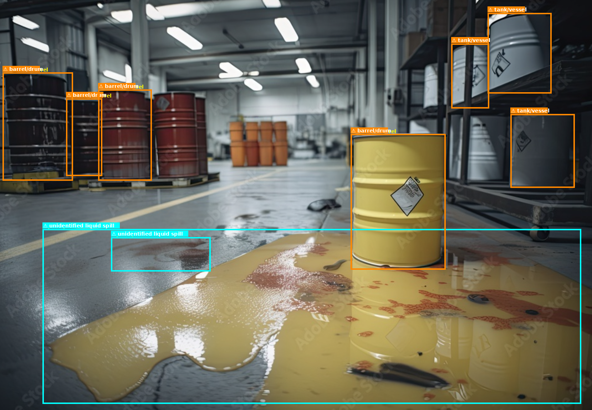
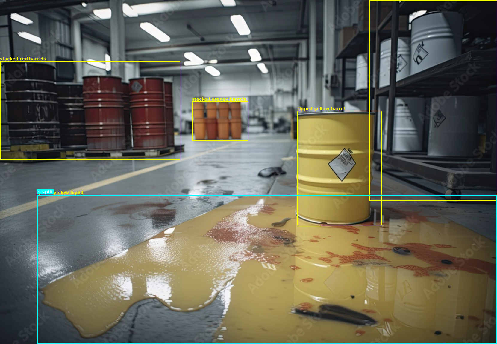

# Hazardous Scene Analyzer

A multi-model pipeline for detecting and assessing hazards in industrial environments. It produces structured hazard reports with bounding box annotations and operator-facing explanations, and supports two operating modes:

**Offline mode** runs entirely on-device using three local models — OWLv2 (open-vocabulary detection), Florence-2 (captioning and phrase grounding), and Llama-3.2-3B (LLM reasoning). No internet connection is required at inference time. Models are loaded from HuggingFace checkpoints on first run and cached locally. This mode is designed for edge deployment on hardware such as NVIDIA Jetson boards where connectivity cannot be guaranteed.

**Online mode** sends the image to a hosted vision-language model (Qwen3-VL-8B via OpenRouter, or GPT-4o via OpenAI) in a single API call. The model performs detection, captioning, and hazard assessment in one shot — no local GPU required, just an API key and internet access.

Both modes produce the same JSON output format and terminal report. Assessment depth — and therefore severity ratings — may differ between modes: the online VLM reasons over the raw image in one pass, while the offline stack combines OWLv2 detections, Florence captions, and LLM reasoning, which can produce a more conservative or more aggressive severity estimate for the same scene. For detailed hardware requirements and edge deployment, see the [Offline and Edge Deployment](#offline-and-edge-deployment) section.

---

## How It Works

### Offline mode (`offline.py`)

Four stages run locally on-device:

**1. Detection**
OWLv2 detects objects and hazard regions using 24 natural-language queries (fire, smoke, spills, barrels, structural damage, personnel, etc.). Results go through three cleanup passes: per-category confidence thresholds, type-aware IoU deduplication, and per-type instance caps.

**2. Captioning**
Florence-2 generates a detailed scene description and dense per-region captions. These are used as input to the LLM and as fallback context if the LLM fails.

**3. Phrase Grounding**
Florence-2's phrase grounding task localises hazard vocabulary against the scene caption to produce bounding boxes. When a hazmat placard is detected, the region is cropped and passed through Florence OCR to identify the UN class number and substance keywords.

**4. Hazard Assessment**
A 4-bit quantized Llama-3.2-3B-Instruct receives all evidence — detected objects, scene caption, region descriptions, and grounded hazard locations — and returns a structured JSON assessment. If the LLM fails, a keyword-based fallback runs automatically.

### Online mode (`online.py`)

A single API call to a hosted VLM (Qwen3-VL-8B via OpenRouter, or GPT-4o via OpenAI) replaces all four stages. The model receives the image and a structured system prompt, and returns the same JSON assessment in one shot. No local models are loaded — detection, captioning, grounding, and reasoning all happen inside the hosted model. Bounding box coordinates are returned in the JSON response and plotted onto the output image as a post-processing step.

---

## Output

Each image produces:

| Field | Description |
|---|---|
| `objects_detected` | All objects identified by OWLv2 and Florence (offline) or Qwen3-VL (online) |
| `possible_hazards` | Canonical hazard types: fire, smoke, chemical, spill, structural, electrical, biological |
| `severity` | Overall severity: low / medium / high / critical |
| `explanation` | Risk-focused narrative for the operator — why the hazards are dangerous and what action is needed |
| `confidence` | Model confidence score (0.0 – 1.0) |
| `clarifying_question` | Single highest-priority question that would change the response protocol |

**Example output (`<name>_result.json`):**

```json
{
  "objects_detected": ["barrel", "worker", "forklift"],
  "possible_hazards": ["chemical", "spill"],
  "severity": "high",
  "explanation": "HIGH CHEMICAL hazard: appropriate PPE cannot be selected until the substance is identified — treat as hazardous until confirmed otherwise. HIGH SPILL hazard: creates slip, contamination, and potential ignition risk — the substance must be identified before containment can begin. Compounding factors: storage barrels near the hazard zone raise contamination risk if contents are unknown or containers are damaged; workers detected inside the hazard perimeter — evacuation status must be confirmed. Do not enter the area without full PPE. Isolate the zone and contact HAZMAT response.",
  "confidence": 0.82,
  "clarifying_question": "What substance does the container or barrel label identify? This determines the required PPE and containment protocol."
}
```

**Annotated output examples:**

| Original image | Offline mode — OWLv2 bounding boxes | Online mode — Qwen3-VL bounding boxes |
|---|---|---|
|  |  |  |

---

## Project Structure

```
.
├── hd.py                          # Pipeline orchestrator (thin — delegates to modules)
├── offline.py                     # Offline runner CLI (OWLv2 + Florence-2 + Llama)
├── online.py                      # Online runner CLI (single VLM API call)
├── .env.sample                    # API key template — copy to .env and fill in keys
│
├── engines/
│   ├── florence_engine.py         # Florence-2 wrapper: loading, preprocessing, all tasks
│   ├── llm_engine.py              # LLM wrapper: 4-bit loading, streaming, JSON parsing
│   └── qwen_engine.py             # VLM API wrapper (OpenAI-compatible: OpenRouter, OpenAI, Qwen)
│
├── utils/
│   ├── assessment.py              # Hazard assessment logic (LLM + keyword fallback)
│   ├── grounding.py               # Phrase grounding, IoU dedup, placard OCR
│   ├── online_processing.py       # Online pipeline: bbox conversion, postprocess, constants
│   ├── reporting.py               # Terminal report and annotated image output
│   └── prompts.py                 # LLM system prompts and HAZMAT vocabulary
│
├── object_Dectetion/
│   └── owl.py                     # OWLv2 detector — drop-in for Florence detection
│
└── configs/
    ├── hazard_config.yaml          # Labels, keywords, colours, severity messages, UN hazmat classes
    └── config.yaml                 # OWLv2 queries, confidence thresholds, instance caps
```

---

## Installation

**1. Clone the repository**

```bash
git clone https://github.com/jaliyanimanthako/HazardousSceneAnalyzer.git
cd HazardousSceneAnalyzer
```

**2. Create a conda environment with Python 3.10**

```bash
conda create -n hazard-analyzer python=3.10 -y
conda activate hazard-analyzer
```

**3. Install dependencies**

```bash
pip install -r requirements.txt
```

**4. Set up keys in `.env`**

```bash
cp .env.sample .env
# Edit .env and fill in the values below
```

| Key | Required for | Where to get it |
|---|---|---|
| `HF_TOKEN` | Offline mode (Llama download) | [huggingface.co/settings/tokens](https://huggingface.co/settings/tokens) |
| `OPENROUTER_API_KEY` | Online mode (default) | [openrouter.ai/keys](https://openrouter.ai/keys) |

> **API cost:** Qwen3-VL-8B via OpenRouter (default) is free. `OPENAI_API_KEY` is only needed if you explicitly pass `--provider openai`; it is not required for the default setup.

> **Llama access:** Before running offline mode, you must accept the Llama-3.2 licence at [huggingface.co/meta-llama/Llama-3.2-3B-Instruct](https://huggingface.co/meta-llama/Llama-3.2-3B-Instruct) using the same HuggingFace account as your token. Access is granted by Meta — first-time requests typically take **10–15 minutes** to be approved. You will receive an email confirmation once access is granted.

---

## Running Modes

### Offline mode — `offline.py`

Runs three local models (OWLv2 + Florence-2 + Llama) entirely on-device. No internet required after the initial model download. Produces colour-coded annotated images with bounding boxes.

> **Hardware:** Designed for edge deployment on NVIDIA Jetson (AGX Orin or similar). For desktop development, an NVIDIA GPU with CUDA support is required — tested on an NVIDIA RTX 6000 Quadro. The full pipeline loads ~10–12 GB VRAM; a GPU with at least 12 GB VRAM is strongly recommended. A standard RTX 3080 (10 GB) may not have enough headroom to load the full stack.

```bash
# Single image
python offline.py /path/to/image.jpg

# Entire folder
python offline.py /path/to/folder/

# Custom output directory
python offline.py /path/to/folder/ /path/to/output/
```

### Online mode — `online.py`

Sends the image to a hosted VLM (Qwen3-VL-8B via OpenRouter, or GPT-4o via OpenAI) in a single API call. No local GPU required — set your API key in `.env` (see Installation step 3) and run.

```bash
# OpenRouter (default) — uses qwen/qwen3-vl-8b-instruct
python online.py /path/to/image.jpg

# GPT-4o
python online.py /path/to/image.jpg --provider openai

# Custom model or endpoint
python online.py /path/to/folder/ --model qwen-vl-max --out-dir results/

# Pass API key directly (overrides .env)
python online.py /path/to/image.jpg --api-key sk-... --provider openai
```

Output is saved to `results/` (or the specified directory):
- `annotated_<name>.jpg` — annotated image (offline) or original image (online)
- `<name>_result.json` — clean JSON result for that image
- `all_results.json` — combined results for folder runs

### Choosing a mode

| | Offline (`offline.py`) | Online (`online.py`) |
|---|---|---|
| Internet required | No | Yes |
| GPU required | Yes (10–12 GB VRAM) | No |
| Bounding boxes | Yes | Yes |
| Speed | ~30–50s per image | ~5–15s per image |
| Accuracy | Good | Varies (model-dependent — online does not always return higher severity) |
| Cost | Free after download | API usage cost |

> **Latency note:** The speed gap above is measured on a mid-range desktop GPU. On sufficiently powerful hardware (e.g. NVIDIA RTX 6000 / A100-class or high-end Jetson), offline inference time drops to the same order as a typical API round-trip, making the latency difference between modes negligible.

---

## Models

| Model | Role | Default checkpoint | Parameters |
|---|---|---|---|
| OWLv2-Large | Object / hazard detection | `google/owlv2-large-patch14-ensemble` | ~400M |
| Florence-2 | Scene captioning, phrase grounding, OCR | `microsoft/Florence-2-base` | 232M |
| Llama | Hazard reasoning, JSON assessment | `meta-llama/Llama-3.2-3B-Instruct` | 3.21B |

If your GPU has less than 6 GB VRAM, switch OWLv2 to `google/owlv2-base-patch16-ensemble` in `offline.py`.

The LLM is loaded in 4-bit (BitsAndBytes) by default. Florence-2 runs in float16 on CUDA and float32 on CPU.

---

## Offline and Edge Deployment

The default model selection is sized for Jetson AGX Orin (64 GB unified memory) or similar onboard GPU platforms:

| Model | Approx. memory | Notes |
|---|---|---|
| `owlv2-large-patch14-ensemble` | ~8 GB | Switch to base variant on lower-memory boards |
| `Florence-2-base` | ~1.5 GB | base keeps latency low; large adds ~1 GB |
| `Llama-3.2-3B-Instruct` (4-bit) | ~2 GB | 4-bit quantization via BitsAndBytes |

On Jetson, PyTorch uses the onboard CUDA GPU automatically — no code changes are needed. If BitsAndBytes 4-bit quantization is not available on a given JetPack version, set `use_llm=False` in `HazardousSceneAnalyzer` to fall back to the keyword-based assessment which has no LLM dependency.

**Pre-downloading models for offline use**

Before deploying to a machine without internet access, download the models on a connected machine. Llama requires a HuggingFace token — run `huggingface-cli login` first, or set `HF_TOKEN` in `.env` and let `offline.py` authenticate automatically.

```python
from huggingface_hub import login
login(token="hf_...")   # or set HF_TOKEN in .env and run offline.py directly

from transformers import AutoProcessor, AutoModelForCausalLM, AutoTokenizer

AutoModelForCausalLM.from_pretrained("microsoft/Florence-2-base", trust_remote_code=True)
AutoModelForCausalLM.from_pretrained("google/owlv2-large-patch14-ensemble")
AutoTokenizer.from_pretrained("meta-llama/Llama-3.2-3B-Instruct")
AutoModelForCausalLM.from_pretrained("meta-llama/Llama-3.2-3B-Instruct")
```

HuggingFace caches weights to `~/.cache/huggingface/hub/` by default. Copy that directory to the target machine and set:

```bash
export HF_HUB_OFFLINE=1
```

This prevents any attempt to reach the HuggingFace hub and forces local cache use.

---

## Configuration

All detection behaviour is controlled through YAML — no Python changes needed for tuning.

**`configs/config.yaml`** — OWLv2 settings:
- `queries` — the 24 natural-language detection queries
- `category_conf` — per-type confidence floors (e.g. spill: 0.22, fire: 0.08)
- `type_max_instances` — maximum bounding boxes kept per hazard type

**`configs/hazard_config.yaml`** — Pipeline settings:
- `always_check` — phrases grounded on every image regardless of caption
- `display_labels` — phrase to annotation label mapping
- `substance_hedges` — regex patterns that replace overconfident substance names (e.g. "oil" → "unidentified liquid")
- `hazard_keywords` — keyword fallback lists per hazard type
- `hazmat_classes` — UN class numbers to human-readable names (used for placard OCR)
- `hazmat_placard_keywords` — text keywords found on placards (FLAMMABLE, CORROSIVE, etc.)
- `hazard_colors` — bounding box colours per hazard type

---

## Debugging Individual Modules

Each module is independently testable without running the full pipeline:

```python
# Test Florence-2 on a single image
from engines.florence_engine import FlorenceEngine
from PIL import Image

engine = FlorenceEngine("microsoft/Florence-2-base")
img = Image.open("test.png").convert("RGB")
print(engine.detect_objects(img))
print(engine.get_detailed_caption(img))
print(engine.read_text(img))   # OCR

# Test LLM JSON parsing without GPU
from engines.llm_engine import LLMEngine
raw = '{"hazards": [{"type": "fire"'   # truncated
print(LLMEngine.parse_json(raw))

# Test phrase grounding helpers without models
from utils.grounding import build_scene_phrases
from utils.prompts import HAZMAT_VOCABULARY
phrases = build_scene_phrases("smoke rising from a barrel", HAZMAT_VOCABULARY, ["fire"])
print(phrases)
```
